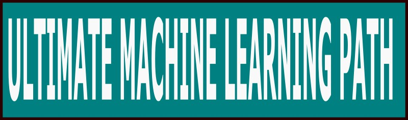

# UltimateMachineLearningPath

The **Ultimate Machine Learning Path** is a project designed to guide you through the journey of mastering machine learning, providing a structured and comprehensive path for both beginners and experienced practitioners.

## Overview

Machine learning is a rapidly growing field that combines **statistics**, **computer science**, and **domain knowledge** to create models that learn from data.

This repository is a set of tutorials, examples, and projects that will help you build a strong foundation in machine learning and progress to advanced topics.

## What You Will Learn

The Ultimate Machine Learning Path is divided into several stages, each focusing on key concepts and skills required in the field of machine learning:

1. **Fundamentals of Machine Learning**:
   - Introduction to machine learning concepts.
   - Understanding supervised and unsupervised learning.
   - Basic data preprocessing techniques.

2. **Mathematics for Machine Learning**:
   - Linear algebra essentials.
   - Probability and statistics.
   - Calculus for optimization.

3. **Core Machine Learning Algorithms**:
   - Linear regression, logistic regression.
   - Decision trees, random forests.
   - Support vector machines.
   - K-nearest neighbors.

4. **Advanced Machine Learning**:
   - Ensemble methods.
   - Dimensionality reduction techniques.
   - Model evaluation and selection.

5. **Deep Learning**:
   - Introduction to neural networks.
   - Convolutional neural networks (CNNs).
   - Recurrent neural networks (RNNs).
   - Generative adversarial networks (GANs).

6. **Specialized Topics**:
   - Natural language processing (NLP).
   - Reinforcement learning.
   - Time series analysis.

7. **Real-world Projects**:
   - Hands-on projects that apply learned concepts to solve real-world problems.
   - End-to-end machine learning pipelines.

8. **Tools and Frameworks**:
   - Overview of popular tools such as TensorFlow, PyTorch, Scikit-learn, and more.
   - Best practices for using these tools effectively.

## How to Use This Repository

1. **Clone the Repository**: Start by cloning this repository to your local machine.

   ```bash
   git clone https://github.com/dr-saad-la/UltimateMachineLearningPath.git
   ```

2. **Follow the Path**: The repository is organized into directories corresponding to the different stages of the learning path. Begin with the fundamentals and work your way up to more advanced topics.
3.	**Explore and Contribute**: Explore the resources provided, complete the exercises, and feel free to contribute by adding new resources, fixing issues, or suggesting improvements.

## Contributing

We welcome contributions from the community! If you have suggestions for improving the content or want to add new sections, please create a pull request. Be sure to follow the contribution guidelines provided in the CONTRIBUTING.md file.

## License

This repository is licensed under the [MIT License](LICENSE). See the LICENSE file for more details.
